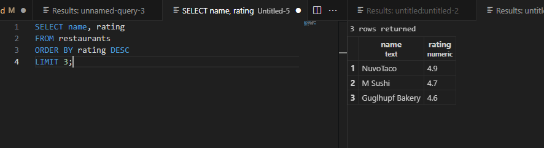
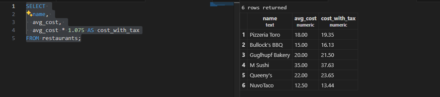

# ids706-postgres-demo
__a. Return name, distance_miles for restaurants within 2.0 miles, ordered by distance.__

__b. Show the top 3 restaurants by rating (highest first).__

__c. List name, avg_cost and cost with 7.5% tax as cost_with_tax.__

__d. How many restaurants are there per cuisine, highest count first?__

